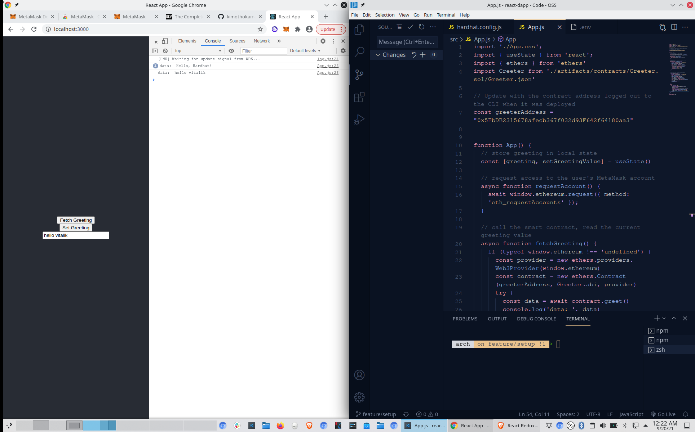

# Basic Sample Hardhat Project

This project demonstrates a basic Hardhat use case. It comes with a sample contract, a test for that contract, a sample script that deploys that contract, and an example of a task implementation, which simply lists the available accounts.

Try running some of the following tasks:

```shell
npx hardhat accounts
npx hardhat compile
npx hardhat clean
npx hardhat test
npx hardhat node
node scripts/sample-script.js
npx hardhat help
```

# About

This is the repository of building an ethereum app using react. 'The complete guide to full stack ethereum development' [Link](https://dev.to/dabit3/the-complete-guide-to-full-stack-ethereum-development-3j13)



### Details
Greeter deployed to: `0x5FbDB2315678afecb367f032d93F642f64180aa3`
